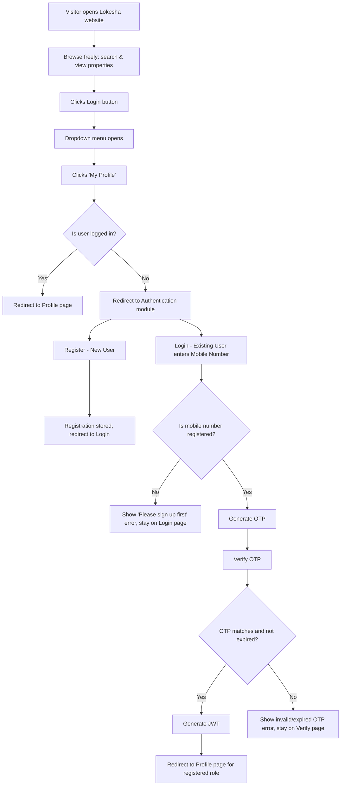

# User Authentication — Backend Specification

## 1. Overview

### Purpose

This document describes the complete backend implementation required for the **Authentication module** of the Lokesha platform.

The frontend UI for Signup, Login, and OTP Verification has already been developed. This document defines:

- How the backend should behave
- Which APIs should be created
- Database design
- Validation rules
- Business logic and authentication flow

Lokesha is a real estate platform (similar to MagicBricks) where users can browse the website without registering or logging in. Authentication is required only when a user wants to access protected features such as **My Profile**.

### Objectives

The module must allow users to:

1. Register a new account.
2. Authenticate using Mobile Number and OTP.
3. Generate a JWT after successful authentication.
4. Get redirected to the Profile page based on their registered role.

> **Scope:** Only backend functionality needs to be implemented.

---

## 2. Current Implementation Status

### Already Completed

- [x] Signup UI
- [x] Login UI
- [x] OTP Verification UI

### Pending

- [ ] Database Design
- [ ] Authentication APIs
- [ ] Joi Validation
- [ ] Password Hashing
- [ ] OTP Generation
- [ ] OTP Verification
- [ ] JWT Authentication
- [ ] Profile Redirection
- [ ] Backend Integration with Frontend
- [ ] Landing page: header, Login dropdown, and profile page (a single profile page that renders different content based on the logged-in user's role)

---

## 3. Authentication Flow

### Purpose

Lokesha is a public real estate platform similar to MagicBricks. Any visitor can browse the website, search properties, view property details, and explore the platform without creating an account or logging in.

Authentication is required only when the user attempts to access features that belong to their personal account, such as **My Profile**.

### Header / Login Dropdown Behavior

The website header contains a **Login** button. Clicking it opens a dropdown with:

- My Profile
- My Activity
- Recommendations
- Login
- Register

When the user clicks **My Profile**, the system checks whether the user is already authenticated:

| Case | Condition | Result |
|---|---|---|
| 1 | User is already logged in | Redirect directly to their Profile page |
| 2 | User is not logged in | Redirect to the Authentication module (Register or Login) |

After successful authentication, the user is redirected to the Profile page according to the role stored in the database.

### Complete User Journey



### Authentication Process

Authentication consists of three independent steps.

#### Step 1 — User Registration

The Registration page is used **only** for creating a new account.

The user provides:

- Role
- Name
- Email Address
- Password
- Mobile Number

The backend validates the data using Joi validation, hashes the password using bcrypt, and stores the user information in the database.

**Registration does not authenticate the user and does not generate an OTP.**

After successful registration:

- User information is stored in the database.
- Password is stored in hashed format.
- `otp_code` remains `NULL`.
- `otp_expires_at` remains `NULL`.
- Frontend redirects the user to the Login page.

#### Step 2 — Login

The Login page is used **only** to initiate the OTP authentication process.

The user provides:

- Role
- Mobile Number

Captcha validation is handled only on the frontend.

When the Login button is clicked, the backend:

1. Validates the request.
2. Checks whether the mobile number exists (the selected role is not used for this check — see §5).
3. If it exists, generates a new 4-digit OTP, stores the OTP + expiry time in the database, and returns a success response. The frontend then redirects to the OTP Verification page.
4. If it does not exist, returns an error response instructing the user to sign up first. No OTP is generated or stored. The frontend stays on the Login page and displays this message — it does **not** redirect to the OTP Verification page.

#### Step 3 — OTP Verification

The OTP Verification page completes the authentication process. By the time this step is reached, the mobile number has already been confirmed to belong to a registered user during Login (Step 2) — this page's only job is to check the OTP itself.

The backend validates:

- OTP matches the `otp_code` stored for that mobile number.
- OTP has not expired (`otp_expires_at`).

If verification succeeds:

1. Generate JWT.
2. Determine the user's registered role.
3. Redirect the user to the Profile page.

If the OTP does not match or has expired, the backend returns a generic invalid/expired OTP error, and the frontend does **not** redirect to the Profile page.

---

## 4. Business Requirements

### Public Website Access

Lokesha allows visitors to browse the website without logging in. Users can freely:

- Browse properties
- Search properties
- View property details
- Explore the platform

Authentication is required only for protected features.

### Protected Features

Protected features include:

- My Profile
- My Activity
- Recommendations
- Any future feature that belongs to a logged-in user

Behavior when a protected feature is clicked:

- If already logged in → open the requested page.
- If not logged in → redirect to the Authentication module.

### Registration

A new user creates an account by providing: Role, Name, Email, Password, Mobile Number.

Backend responsibilities:

- Validate data.
- Hash password.
- Store user.
- Do **not** generate OTP.
- Keep OTP fields `NULL`.
- Redirect frontend to the Login page.

### Login

The Login page is used to check registration and generate an OTP. The backend accepts Role and Mobile Number — **the selected role is not used to determine whether the account exists or which account it is** (see §5); it is only checked for shape by validation.

The backend must:

- Validate the request.
- Check whether the mobile number belongs to a registered user.
- If registered: generate an OTP, store it with its expiry, and return a success response. Frontend redirects to the Verify OTP page.
- If not registered: return an error response asking the user to sign up first. No OTP is generated. Frontend stays on the Login page and shows this message — it does **not** redirect to the Verify OTP page.

### OTP Verification

The Verify OTP page completes authentication. By this point the mobile number is already known to be registered (checked during Login). Backend responsibilities:

- Validate that the submitted OTP matches the stored `otp_code` for that mobile number.
- Check OTP expiry.
- If it matches and has not expired: clear the OTP, generate JWT, return the user's registered role. Frontend redirects to `/user/dashboard`.
- If it does not match or has expired: return a generic invalid/expired OTP error. Frontend stays on the Verify OTP page and does **not** redirect.

---

## 5. Important Business Rule — Role Selection

### Purpose

The role selected on the Login screen is **only a UI selection**. It must never determine which Profile page the user accesses.

> The role stored in the database during Registration is always considered the source of truth.

### Example

| Step | Field | Value |
|---|---|---|
| Registered as | Role | Buyer |
| Registered as | Mobile Number | 9876543210 |
| During Login | Role Selected | Builder |
| During Login | Mobile Number | 9876543210 |

1. OTP is verified successfully.
2. Backend checks the database → returns role: **Buyer**.
3. Backend generates JWT:

   ```json
   {
     "role": "buyer"
   }
   ```

4. Frontend redirects to `/profile` with the buyer role and shows buyer profile content.

The selected **Builder** role is ignored completely. The backend must **never** return a "role mismatch" or "user not found because of selected role" error — it must always trust the registered role stored in the database.

---

## 6. Database Design

### Table: `users`

| Column | Type | Description |
|---|---|---|
| `id` | UUID | Primary Key |
| `role` | ENUM | `buyer`, `owner`, `agent`, `builder` |
| `name` | VARCHAR(100) | User's full name |
| `email` | VARCHAR(255) UNIQUE | User email address |
| `password` | VARCHAR(255) | Bcrypt-hashed password |
| `mobile_number` | VARCHAR(20) | User mobile number |
| `otp_code` | VARCHAR(4) NULL | Stores latest generated OTP during Login |
| `otp_expires_at` | TIMESTAMP NULL | OTP expiry time |
| `created_at` | TIMESTAMP | Record created time |
| `updated_at` | TIMESTAMP | Record updated time |

### Notes

- Password must always be stored in hashed format.
- OTP fields remain `NULL` immediately after Registration.
- OTP values are updated only during Login.
- OTP values should be cleared after successful verification.

---

## 7. Folder Structure

```text
modules/
  auth/
    auth.routes.js
    auth.controller.js
    auth.validation.js
    auth.service.js
    auth.repository.js

middlewares/
  auth.middleware.js

utils/
  jwt.js
  otp.js
  bcrypt.js
```

| File | Description |
|---|---|
| `auth.routes.js` | Defines all authentication routes |
| `auth.controller.js` | Handles incoming requests and responses |
| `auth.validation.js` | Contains Joi validation schemas |
| `auth.service.js` | Contains authentication business logic |
| `auth.repository.js` | Handles all database queries |
| `auth.middleware.js` | JWT authentication middleware |
| `jwt.js` | JWT generation and verification |
| `otp.js` | OTP generation helper |
| `bcrypt.js` | Password hashing helper |

---

## 8. Validation Rules

### Purpose

All incoming requests must be validated before reaching the controller. Validation should be implemented using **Joi**.

### Signup Validation

| Field | Validation |
|---|---|
| `role` | Required |
| `name` | Required, minimum 3 characters |
| `email` | Required, valid email format |
| `password` | Required |
| `mobile_number` | Required, minimum 10 digits |

### Login Validation

| Field | Validation |
|---|---|
| `role` | Required |
| `mobile_number` | Required, minimum 10 digits |

> **Note:** Although the role is required by the UI, the backend should not use it for authentication. The registered role stored in the database is always the source of truth.

### Verify OTP Validation

| Field | Validation |
|---|---|
| `mobile_number` | Required |
| `otp` | Required, exactly 4 digits |

---

## 9. API Summary

| Method | Endpoint | Description |
|---|---|---|
| POST | `/api/auth/signup` | Register a new user |
| POST | `/api/auth/login` | Initiate OTP authentication |
| POST | `/api/auth/verify-otp` | Verify OTP and authenticate user |

---

## 10. Security Requirements

### Purpose

The Authentication module should follow standard backend security practices to ensure user credentials and authentication data are protected.

### Password Security

- Passwords must never be stored in plain text.
- Hash passwords using bcrypt with 10 salt rounds.
- Password hashes must never be returned in API responses.

### OTP Security

- OTP should be generated only during Login, and only for mobile numbers that are already registered. Unregistered mobile numbers must never receive an OTP.
- OTP should consist of exactly 4 numeric digits.
- OTP should expire after 2.21 minutes.
- OTP must be cleared after successful verification.
- Expired OTPs must never be accepted.

### JWT Security

- Generate JWT only after successful OTP verification.
- JWT validity should be 7 days.
- Protected APIs must always validate the JWT before processing the request.

### Validation

- Validate all incoming requests using Joi before reaching the controller.
- Return meaningful validation error messages to the frontend.

### Database Security

- Use parameterized queries (Knex) to prevent SQL Injection.
- Never expose internal database errors to the client.
- Store only hashed passwords and temporary OTP values.

### Frontend Responsibility

- Captcha validation is handled entirely on the frontend.
- The backend does not validate the captcha.
- The frontend is responsible for storing the JWT securely and sending it in the `Authorization` header when accessing protected APIs.
